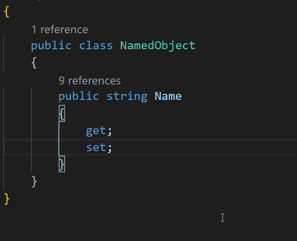

## the case	
the question is addressing some of the 4 pillars of OOP

## toc
<!-- TOC -->

- [inheritance](#inheritance)
    - [inheritance > demo](#inheritance--demo)
        - [STEP-1 create a base class (location: file-specific)](#step-1-create-a-base-class-location-file-specific)
        - [STEP-2 define a constructor within the base class (location: line-specific)](#step-2-define-a-constructor-within-the-base-class-location-line-specific)
        - [STEP-3 define an inheritance relationship](#step-3-define-an-inheritance-relationship)
- [polymorphism](#polymorphism)

<!-- /TOC -->

## findings

### inheritance
* often overrated in solving your day-to-day problem
* ability to reuse code
* offers you to define a base class and derive class
* members of a base class can be members of the derived class
* aim: reuse code, follow **DRY principle** 

#### inheritance > demo
* simple property name can be in a number of classes within the application of a gradebook (students, groups, teachers, etc.)

##### STEP-1 create a base class (location: file-specific)
* the base class should be located in it's own dedicated file
    * if all other classes are derived from this one, you never have to write the following piece of code agai
    * ... just set the name of an object (or pass it into a constructor)
    
```c#
    public class NamedObject
    {
        public string Name
        {
            get;
            set;
        }
    }
```

##### STEP-2 define a constructor within the base class (location: line-specific)



##### STEP-3 define an inheritance relationship
* so that you don't have to write the name property in the derived class
* in the example below, `Book` **becomes** a `NamedObject`, a much more abstract base class

CODE                              | COMMENT
----------------------------------|---------------------------------------------------------------
`public class Book : NamedObject` | use `: BaseClass` notation to define the inheritance
`Name = name;`                    | this line within a constructor utilizes the inherited property

```c#
// STEP-2 define an inheritance relationship
    public class Book : NamedObject // 1

    {
        public Book(string name)
        {
            grades = new List<double>();
            Name = name; // 2 
        }
// ...
```

### polymorphism
* objects of the same type can behave differently

## terminology
* inheritance > base class
* inheritance > derived class
 
## sources