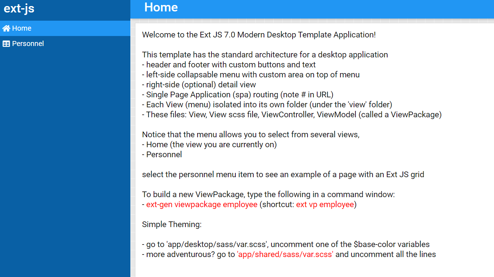

## the case
the puzzle is, how to quickly setup the webapp with ExtJS, which seems to be vanishing (compared to angular or react) but still seems to be used in many enterprises as a library used for browser-based applications

## TOC
<!-- TOC -->

- [HSTR](#hstr)
- [SETUP](#setup)

<!-- /TOC -->

### HSTR
* Sencha was formed in 2010, with the merge of ExtJS, Raphael and JQTouch
* ExtJS was one of the first JS frameworks, coming to being in 2007
* Sencha was sold in 2017 to IDERA (the owner of Travis CI)

### SETUP
1. Subscribe to the [Ext JS Community Edition - Sencha.com](https://www.sencha.com/products/extjs/communityedition/)
2. Reset your password
3. Log into NPM with `npm login --registry=https://sencha.myget.org/F/community/npm --scope@sencha` 
4. Download the ExtJS generator with `npm install -g @sencha/ext-gen`
5. Build the first app with the installed generator with `ext-gen -app i` 
6. Navigate to the folder name  
7. Launch the Hello World App with `npm start`

